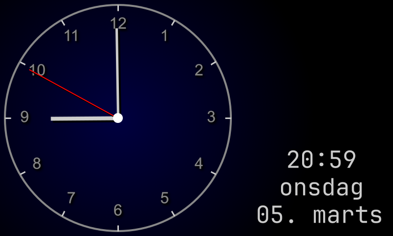
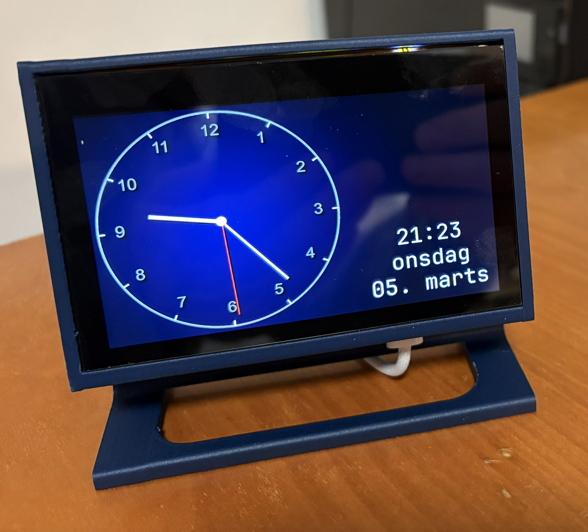

# dr.RpiClock

**Creates an Internet enabled clock based on a Raspberry Pi**

[](https://github.com/driis/dr.RpiClock/actions/workflows/dotnet.yml)



This is a .NET program that modifies the framebuffer on a linux system to draw a clock.
Paired with an 800x480 4.3 inch Waveshare LCD and a 3D-printed housing; this makes an internet enabled clock for my nightstand.

## Why on earth would I build something like this this ?
For fun - and to a large extent, to challenge myself to learn a bit about the hardware and the Raspberry Pi environment
I've had this idea to create my own bedside clock for a while; and maybe I'll extend it with functionality
in the future; for example to show today's weather or other important information.

The project uses the low level frame buffer interface to draw a bitmap to the screen. There is no 
need to install any GUI components on the linux system. While this is probably not the most efficient
way of achieving this, learning was the key in this project. It is also nice I don't need to
boot a GUI on an already underpowered Raspberry Pi.

At the same time having a bedside clock that can double as the at home server is also kind of cool ;)

## Running on Raspberry Pi
Make sure you have a suitable LCD attached, you might need to fiddle with the parameters.
Make sure you have .NET 8 installed

Run:
```
dotnet run -- -c /dev/fb0
```

The parameter `-c` is to run continuously, that is, animate the clock on the screen.
The `/dev/fb0` is the filename to output to. In this case it's a _framebuffer_ representing the screen,
but you can choose to write to any file.

Current program / config assumes a display of 800x480 with 32 bits per pixel. You may want fiddle with your settings to achieve this, 
or change the program accordingly.

You may need to install the font used (JetBrains Mono) to `/usr/share/fonts`.

I had to disable DRM VC4 V3D driver to get this to work, comment this line in `/boot/firmware/config.txt` to do so:
```
# dtoverlay=vc4-kms-v3d
```

Depending on whether you use the 3D printed case or not, you may want to rotate the display. This is also done in `config.txt`:
```
lcd_rotate=2
```

Finally, to adjust brightness, you can write to `/sys/class/backlight/rpi_backlight/backlight`
For my usage, 32 was a good number, the brightness ranges from 0 to 255:
```
echo 32 > /sys/class/backlight/rpi_backlight/backlight
```

## Debugging or on a Windows system
If you omit `-c`, we run the render loop once, and exit immediately. If you pass a filename, you can view the bitmap after 
the run

```
dotnet run test.bmp
```

# Resources
* [Waveshare LCD used](https://www.waveshare.com/wiki/4.3inch_DSI_LCD)
* [RPI + LCD Housing](Stand/rpi-stand%20v1.3mf) (or on [Makerworld](https://makerworld.com/en/models/1145572-stand-for-raspberry-pi-with-4-3-inch-lcd-display#profileId-1148808))


